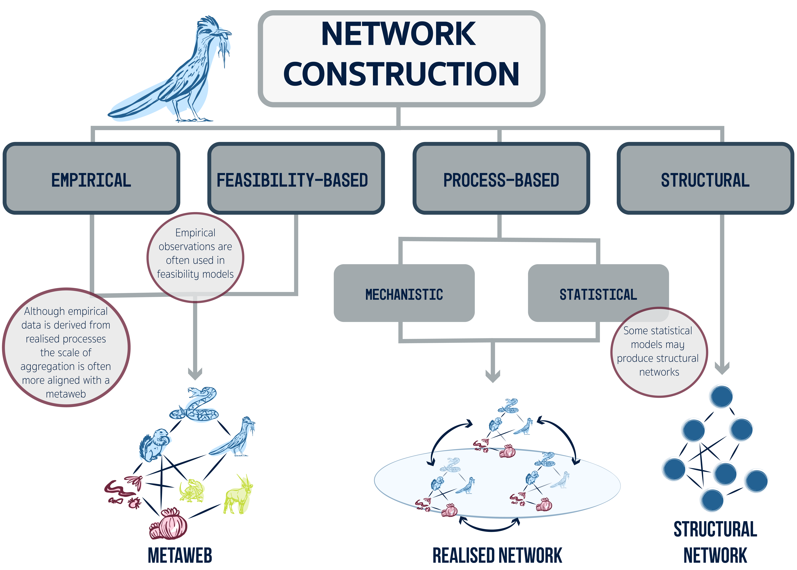

# Introduction

At the heart of modern biodiversity science are theories linking species richness, stability, and ecosystem functioning, from the foundational work of @eltonAnimalEcology2001, @lindemanTrophicDynamicAspectEcology1942, and @macarthurFluctuationsAnimalPopulations1955 through to contemporary questions about biodiversity loss and ecosystem resilience. Trophic ecological networks (food webs) have become a central representation for studying these questions because they capture the organisation of feeding interactions that underpin energy flow, community structure, and ecosystem functioning [@cohenCommunityFoodWebs1990; @martinezTimeSpaceScale1998; @dunneNetworkStructureBiodiversity2002a; @simmonsRefocusingMultipleStressor2021]. Documenting trophic interactions is therefore a fundamental component of community ecology and provides a powerful abstraction for mathematical and statistical models used to understand biodiversity and anticipate the consequences of environmental change [@windsorUsingEcologicalNetworks2023; @galianaBioticInteractionsBiogeography2026].

Despite their widespread use, there is growing recognition that different food web representations encode different assumptions about ecological processes and therefore support different forms of inference. These challenges have been recognised since early discussions of sampling effort, aggregation, and scale in food webs [@cohenCommunityFoodWebs1990; @polisComplexTrophicInteractions1991; @martinezArtifactsAttributesEffects1991; @bluthgenWhyNetworkAnalysis2010; @dormannRisePossibleFall2023], and remain central to debates about how networks should be interpreted and applied [@bluthgenCriticalEvaluationNetwork2024]. A key challenge is therefore not simply how to construct food webs, but understanding what different representations actually represent, which ecological processes they capture, and which questions they can legitimately answer. A key challenge is therefore not simply how to construct food webs, but understanding what different representations actually represent, which ecological processes they capture, and which questions they can legitimately answer. In this perspective, we provide an overview of alternative food web representations, focusing on how each embeds assumptions about the processes that determine interactions (@sec-process), the levels of organisation at which those processes operate (*i.e.,* biological, ecological, spatial, and temporal scales), and the approaches used to construct the resulting networks (@sec-construct).

Throughout this review we focus explicitly on trophic ecological networks (food webs). Food webs provide a well-developed theoretical foundation for distinguishing interactions that are evolutionarily feasible from those that are realised through ecological processes such as spatiotemporal overlap, abundance, and consumer diet choice. Although ecological communities are also structured by mutualistic, competitive, parasitic, and facilitative interactions, we do not attempt to develop a general framework for all ecological interaction networks. Extending this hierarchy beyond trophic interactions would require additional assumptions about how non-trophic interactions become feasible and realised, and remains an important direction for future synthesis.

Network construction reflects both the data used and the ecological theories governing species interactions. Although the challenges associated with collecting and observing interaction data have been extensively discussed [@bluthgenCriticalEvaluationNetwork2024; @brimacombeShortcomingsReusingSpecies2023; @brimacombePublicationdrivenConsistencyFood2024; @moulatletScalingTrophicSpecialization2024; @pringleResolvingFoodWebStructure2020; @polisComplexTrophicInteractions1991; @saberskiImpactDataResolution2024; @martinezTimeSpaceScale1998; @pimmComplexityStabilityEcosystems1984a], there remains no clear synthesis linking food web representations to the assumptions and scale-dependent processes that underpin their construction. Clarifying these assumptions is essential for improving ecological inference and for predicting how multiple stressors affect biodiverse communities and their functioning.

Recent work by @gauzensTailoringInteractionNetwork2025 synthesised trophic network representations according to node resolution and link type, highlighting the advantages, limitations, and methodological considerations associated with different network types. Here we address a complementary, but distinct, question: **what ecological processes give rise to those different representations?**

We frame food web construction as a hierarchical transition from interaction feasibility to interaction realisation. Rather than classifying networks according to their structural characteristics, we focus on the assumptions embedded in their construction (about ecological entities, feeding interactions, and the processes that constrain or realise them) and show how these assumptions determine the ecological scale, ecological meaning, and inferential scope of a network.

This perspective provides a process-based framework for linking food web representation to ecological inference. In the following sections we examine how nodes, edges, and interaction processes define alternative food web representations, how different construction approaches encode different ecological assumptions, and why matching network representation to the ecological question is essential for interpreting food webs in biodiversity science and environmental change research.

# Setting the Scene: The Not So Basics of Nodes and Edges {#sec-anatomy}

Ecological networks represent an ‘object’ from which inferences can be made and thus serve multiple purposes. While many aspects of community structure can be analysed without networks (*e.g.,* trait distributions or abundance patterns) networks provide a formal framework for capturing the organisation of interactions among species. The study of network structure and topology has a long history in ecology, rooted in early theory on energy flow [@lindemanTrophicDynamicAspectEcology1942; @odumEnergyFlowEcosystems1968], and later extended to questions of robustness, stability, and complexity (*e.g.,* [@pimmComplexityStabilityEcosystems1984a; @mayWillLargeComplex1972a; @dunneNetworkStructureBiodiversity2002a; @broseAllometricScalingEnhances2006; @montoyaEcologicalNetworksTheir2006]). More recent work has built on this foundation to link network structure to ecosystem functioning, persistence, and dynamical behaviour (*e.g.,* [@schneiderAnimalDiversityEcosystem2016; @danetResponseDiversityMajor2024; @pilosofMultilayerNatureEcological2017]). Networks are therefore commonly treated as response variables in tests of ecological theory and statistical models of the generative processes that give rise to observed structure and are widely used to compare communities across environmental gradients or through time [*e.g.,* @haoGlobalProjectionTerrestrial2025; @pecuchetNovelFeedingInteractions2020]. They also provide a platform for evaluating downstream responses to perturbations, including secondary extinctions and robustness to species loss (*e.g.,* [@dunneNetworkStructureBiodiversity2002a; @staniczenkoStructuralDynamicsRobustness2010; @keyesSynthesisingRelationshipsFood2024; @keyesEcologicalNetworkApproach2021]), as well as inference about stability, ecosystem function, invasions, climate change, contaminants, and extinction cascades (*e.g.,* [@delmasSimulationsBiomassDynamics2017; @curtsdotterEcosystemFunctionPredator2019; @terryImpactStructuredHigherorder2025]). Against this backdrop of multiple research agendas, the definition of ‘edges’ and ‘nodes’, and the levels of organisation at which they are defined, take many forms [@poisotDescribeUnderstandPredict2016; @moulatletScalingTrophicSpecialization2024], each of which encode a series of assumptions within a network. Here we introduce an alignment between these questions and baseline assumptions about nodes and edges.

## How do we define a node?

While nodes are conventionally described as representing species, in practice they may correspond to a range of taxonomic and non-taxonomic units, including sub-species, genera, or families, as well as trophic species (*e.g.,* [@yodzisCompartmentationRealAssembled1982; @williamsSimpleRulesYield2000]), feeding guilds (*e.g.,* [@garcia-callejasNonrandomInteractionsGuilds2023]), or life-stage–specific subsets of species (*e.g.,* [@cleggImpactIntraspecificVariation2018]). These choices reflect differences in the level, type, and consistency of resolution at which networks are constructed, rather than aggregation *per se*. Representing nodes at coarser or mixed resolutions can limit taxon-specific inference (*e.g.,* whether species *a* consumes species *b*), bias estimates of degree distributions (particularly generality and vulnerability) and complicate downstream analyses such as extinction or invasion dynamics, where species identity and the consequences of loss may be obscured [@beckermanForagingBiologyPredicts2006; @cleggImpactIntraspecificVariation2018]. At the same time, there are clear justifications for using aggregated representations when the distribution of interactions among functional or trophic units is more informative than species-level detail, for example when analysing extinction patterns across feeding guilds or other functional units [@dunhillExtinctionCascadesCommunity2024]. Issues of resolution, scale, and sampling have long been recognised as central to the construction and interpretation of food webs (*e.g.,* [@martinezTimeSpaceScale1998; @dunneNetworkStructureFood2006]). Consequently, node definition is not merely a methodological choice but an assumption about the ecological entities represented in a network, with direct implications for the processes that can be represented and the questions that can be addressed [@gauzensTailoringInteractionNetwork2025].

## What is captured by an edge? {#sec-edge}

Understanding how edge assumptions impact ecological process representation requires distinguishing between *potential* and *realised* links. Potential links reflect interaction feasibility, whereas realised links reflect ecological fluxes such as energy transfer. Links within food webs may therefore represent either potential interactions between species [@dunneNetworkStructureFood2006; @pringleUntanglingFoodWebs2020] or realised fluxes within a system, such as the transfer of energy or materials resulting from feeding interactions [@lindemanTrophicDynamicAspectEcology1942; @proulxNetworkThinkingEcology2005]. Edges can thus correspond to different ecological 'currencies' [@gauzensTailoringInteractionNetwork2025]. Moreover, links can be specified in multiple ways: they may be treated as present or absent (*i.e.,* binary), defined probabilistically [@banvilleDecipheringProbabilisticSpecies2025; @poisotStructureProbabilisticNetworks2016], or represented by continuous functions that quantify interaction strength [@berlowInteractionStrengthsFood2004]. Link definition therefore depends on both the ecological currency and how interactions are represented. Because different edge definitions encode different ecological processes, they also support different forms of inference. For example, networks composed of feasible interactions can characterise potential trophic structure but are generally insufficient for inferring the magnitude or distribution of energy flow because their links are not environmentally or energetically constrained.

## Network representations {#sec-representation}

These definitions of nodes and edges and associated assumptions give rise to two well established types of ecological networks: **metawebs**, which represent all *potential* interactions within a species pool [@dunneNetworkStructureFood2006], and **realised networks**, which represent the subset of interactions expressed within a particular community at a given place and time. Because of the assumptions made about nodes and edges in these networks, they differ in the scales they represent and the processes assumed to generate their structure.

A metaweb is fundamentally a list of *feasible* interactions between species. Metawebs identify evolutionarily and regionally plausible interactions, ecologically impossible (*i.e.,* forbidden) links [@jordanoSamplingNetworksEcological2016], and the potential diet breadth of species [@strydomGraphEmbeddingTransfer2023]. Feasibility is thus determined by trait complementarity, typically related to feeding, and can be further constrained by species co-occurrence, producing a transition from *global* to *regional* metawebs.

In contrast, realised networks are localised in space and time, with links shaped by co-occurrence, environmental conditions, and diet choice. Even when represented as binary matrices, their links implicitly reflect interaction strength and energy transfer. Realised networks are therefore not simply spatial or temporal subsets of metawebs; they emerge from ecological processes that govern the occurrence and strength of interactions among species. Consequently, a metaweb and realised network containing the same species may differ substantially in structure because link presence is governed by different constraints. Critically, links absent from a metaweb represent infeasible interactions, whereas links absent from a realised network reflect context-dependent ecological constraints. At its most general, a realised network must represent more than the potential for species interactions; it must reflect the processes governing the distribution or strength of interactions within a particular community.

# From Nodes and Edges to Process and Constraints {#sec-process}

In the previous section we discussed how the definition of nodes and edges, representing different scales and processes, lead to the concept of a metaweb and a realised web. The fundamental take-homes are that nodes vary in their resolution, edges vary in what kind of process they represent and the intersection of these, defined by meta- vs. realised webs, underpins distinct lines of inquiry and constraints on the type of inference we can make with networks.

Following this, we develop a process-based framework describing the transition from metawebs to realised food webs. Rather than treating network representations as alternative descriptions of the same community, we argue that they represent different stages in the progression from interaction feasibility to interaction realisation. This transition is governed by five principal trophic processes operating across evolutionary and ecological scales: evolutionary compatibility, spatiotemporal overlap, abundance, consumer diet choice, and non-trophic interaction modification [@fig-process].

These processes are not intended as an exhaustive description of all determinants of trophic interactions. Instead, they capture the principal assumptions embedded in the food web representations discussed throughout this review and provide a framework for understanding what different networks represent and what ecological inferences they support.

![Aligning the processes that determine interactions (right) with different network representations (left). A **global metaweb** captures all feasible interactions among a species pool. Restricting this network by species co-occurrence yields **regional metawebs**, which differ in species composition. Species occurring in both regions are shown in red, whereas region-specific species are shown in blue and yellow. **Realised networks** represent subsets of regional metawebs expressed in specific spatial and temporal contexts. Their structure is shaped not only by co-occurrence, but also by community-level processes such as abundance, diet choice, and non-trophic interactions.](images/anatomy.png){#fig-process}

## Processes that determine the feasibility of an interaction {#sec-process-feasibility}

Evolutionary compatibility and co-occurrence are the two principal processes that define the feasibility of an interaction between two species. The scale of inference and set of processes embodied in these two constraints typically combine to define a 'list' of interactions that are viable/feasible and defined strictly as present/absent. Reflecting on the previous section, nodes are typically species and rules defining edges are defined by trait complementarity (phylogenetic) and/or co-occurrence. Here we provide more insight into each process.

**Evolutionary compatibility**

Interaction feasibility is first constrained by *functional compatibility* between consumers and resources. Traits associated with resource acquisition and defence determine whether a feeding interaction is physically and biologically possible, defining the set of feasible interactions within a metaweb. Evolutionary history and co-evolution shape these traits, making phylogenetic relationships and trait complementarity powerful predictors of interaction feasibility, rather than direct evidence that a particular interaction is realised.

This constraint is therefore rooted in the evolutionary history of consumers and resources [@segarRoleEvolutionShaping2020; @gomezEcologicalInteractionsAre2010; @dallarivaExploringEvolutionarySignature2016; @rossbergFoodWebsExperts2006], which manifests as trait complementarity between species [@benadiQuantitativePredictionInteractions2022]. In this body of theory, consumers possess the traits required to acquire and consume particular resources, while resources possess traits that permit or prevent consumption. Interactions that lack this compatibility are defined as *forbidden links* [@jordanoSamplingNetworksEcological2016]; *i.e.,* feeding interactions that are physically or biologically impossible and therefore absent from the feasible interaction space represented by a metaweb.

Networks do not explicitly arise from models based on this constraint alone. Instead, evolutionary compatibility defines a set of feasible consumer-resource pairs, represented as binary (possible versus forbidden) or probabilistic interactions [@banvilleDecipheringProbabilisticSpecies2025]. For example, in the metaweb constructed by @strydomFoodWebReconstruction2022, probabilities quantify the confidence that a particular feeding interaction is possible between two species. A network constructed from evolutionary compatibility is therefore conceptually aligned with a *global metaweb*, representing the global feasibility of trophic links even among species that do not currently overlap in space or time (@fig-process).

**Spatiotemporal overlap (encounter opportunity)**

A feeding interaction can only be realised if consumers and resources overlap in space and time. We therefore distinguish *spatiotemporal overlap* (the ecological opportunity for species to encounter one another) from *observed co-occurrence*, which is a statistical pattern that may arise for many reasons unrelated to direct interactions [@blanchetCooccurrenceNotEvidence2020]. Spatiotemporal overlap constrains which feasible interactions from a global metaweb can potentially occur within a particular region or community. It therefore provides the transition from global to regional metawebs without implying that all overlapping species *will* interact [@dansereauSpatiallyExplicitPredictions2024]. In the context of @fig-process this would be the metawebs for regions one and two.

Spatiotemporal overlap is therefore a necessary, but not sufficient, condition for trophic interactions. A regional metaweb may be defined for a local community, but locality alone does not imply that interactions are realised; locality constrains the set of feasible interactions, whereas realised food webs represent interactions expressed under local ecological conditions.

We reinforce that a regional metaweb is a network whose edges represent *feasible* consumer-resource interactions under regional species overlap, rather than interactions that have been realised within a community. Although it is possible to visualise a network from the list of interactions generated by these constraints, it is important to be aware that the structure of this network is not constrained by any community context - just because species are able to interact does not mean that they will [@poisotSpeciesWhyEcological2015; @caronTraitmatchingModelsPredict2024]. This distinction is important because many empirical food webs are constructed from species occurrence or co-occurrence information. Confusing encounter opportunity with realised feeding interactions blurs the distinction between regional metawebs and realised food webs, and can lead to fundamentally different ecological interpretations of otherwise similar network structures.

## Processes that realise networks {#sec-process-realisation}

The previous processes define which trophic interactions are feasible. Here we focus on the ecological processes that determine which feasible interactions are realised within a community. Realised food webs emerge from the interaction between community context (spatiotemporal overlap, abundance, and non-trophic interactions) and individual consumer behaviour (diet choice), transforming feasible trophic interactions into realised patterns of energy transfer within ecological communities (Figure @fig-process).

These processes operate after evolutionary compatibility has constrained the feasible interaction space. Rather than creating new trophic interactions, they filter, strengthen, weaken, or prevent the realisation of feasible links under particular ecological conditions.

**Abundance**

Abundance is the simplest ecological process through which feasible trophic interactions become realised. Under a null model of energy acquisition, consumers feed randomly among feasible resources, consuming prey in proportion to their relative abundance [@stephensForagingTheory1986]. Abundance therefore provides a null expectation for the distribution and strength of realised trophic links [@vazquezUnitingPatternProcess2009].

Importantly, abundance operates within the set of evolutionarily feasible interactions defined by the metaweb. Species abundances influence encounter frequencies and the probability that feasible feeding interactions are realised, but they do not determine whether incompatible species can interact. Abundance data, linked to a regional metaweb, therefore provides a foundation from which the distribution and strength of realised trophic interactions can be inferred.

Abundance does not create trophic interactions independently of evolutionary compatibility. Instead, among the set of feasible interactions, species abundances influence encounter frequencies and the probability that feeding interactions are realised [@poisotSpeciesWhyEcological2015; @banvilleDecipheringProbabilisticSpecies2025]. Abundance therefore provides a null expectation for the distribution and strength of realised trophic links, rather than determining whether incompatible species can interact.

**Diet choice**

It is well established that consumers make more selective decisions than feeding on resources purely in proportion to their abundance [@stephensForagingTheory1986]. Consumer diet choice is underpinned by energetic cost-benefit trade-offs centred on prey profitability and constrained by traits associated with resource acquisition and consumption [@woottonModularTheoryTrophic2023; @smithBehavioralResponsesMosaic2021]. Consequently, energetic constraints are invoked in a variety of approaches for constructing realised food webs [e.g. @beckermanForagingBiologyPredicts2006; @pawarDimensionalityConsumerSearch2012; @portalierMechanicsPredatorPrey2019; @cherifEnvironmentRescueCan2024].

Unlike metaweb approaches, these models generate realised food webs as emergent outcomes of consumer behaviour. We distinguish these approaches from models such as the Niche Model [@williamsSimpleRulesYield2000], where diet choice is implicit within a probabilistic network-generating function designed to reproduce expected network structure, rather than emerging from node-level ecological rules. We use *diet choice* as an umbrella term for processes derived from optimal foraging theory [@pykeOptimalForagingTheory1984] and metabolic theory [@brownMetabolicTheoryEcology2004] that determine the energetic distribution and strength of realised trophic interactions.

**Non-trophic interactions**

We include non-trophic interactions not as trophic links in their own right, but as ecological processes that modify the realisation or strength of trophic interactions within realised food webs [@mieleNontrophicInteractionsStrengthen2019; @ingsEcologicalNetworksbeyondFood2009]. They provide community context beyond evolutionary compatibility, spatiotemporal overlap, and abundance by altering encounter rates, feeding success, mortality, or access to resources [@golubskiModifyingModifiersWhat2011; @pilosofMultilayerNatureEcological2017].

These effects may arise through direct interactions among consumers (e.g. predator interference or competition for space) or through indirect ecological interactions (e.g. refuge provisioning, habitat modification, or facilitation) that alter the probability or strength of trophic interactions [@ingsEcologicalNetworksbeyondFood2009; @golubskiModifyingModifiersWhat2011; @staniczenkoStructuralDynamicsRobustness2010; @kamaruDisruptionAntplantMutualism2024].

Some interactions, such as pollination, illustrate why trophic and non-trophic processes are not always cleanly separable. Pollinators consume floral resources through trophic interactions while simultaneously influencing plant reproduction, recruitment, and population persistence through non-trophic processes [@hollandPopulationDynamicsMutualism2002; @bascomptePlantAnimalMutualisticNetworks2007; @sauveHowPlantsConnect2016]. We treat these systems as examples of how non-trophic processes modify trophic network realisation, rather than attempting to incorporate mutualistic networks into this framework [@kefiMoreMealIntegrating2012; @kefiNetworkStructureFood2015; @bucheMultitrophicHigherOrderInteractions2024; @mieleNontrophicInteractionsStrengthen2019].

# Network construction {#sec-construct}

The processes described above are central to understanding the assumptions inherent in building different types of networks. Each process, or combination of processes, imposes a distinct set of boundary conditions on what a network represents and what it can be used for. Here, we build on these processes to categorise approaches to network construction according to the information used to determine interactions and the ecological meaning of the resulting links. In doing so, we distinguish between approaches that observe realised interactions, infer feasible interactions or expected network structure, and model the ecological processes through which feasible interactions become realised. These distinctions are important because different construction approaches encode different assumptions about how interactions arise, and therefore support different ecological questions.

## Why infer food webs?

Food webs are representations of biodiversity, but they are also models of ecological systems. In an ideal world, every trophic interaction could be observed directly. In practice, empirical interaction data are costly, incomplete, and often impossible to collect across entire communities [@jordanoChasingEcologicalInteractions2016; @jordanoSamplingNetworksEcological2016; @poisotGlobalKnowledgeGaps2021]. As a result, food webs are constructed from a combination of empirical observations and/or ecological inference, with different approaches embedding different assumptions about how interactions arise.

These approaches can be distinguished by thinking about the intention of the network construction. Are we determining whether an interaction exists, or are we trying to establish some inference about the structure of the network? On this basis, we distinguish four broad construction approaches: empirical, feasibility-based, process-based, and random (@fig-build). The distinction is important because the resulting networks are fundamentally different. An observed interaction provides evidence that feeding occurred under the sampled conditions; a feasibility-based interaction represents an interaction that could occur given the appropriate conditions *i.e,* a metaweb; a process-based interaction represents interactions that predicted to be realised under specified ecological conditions *i.e,* a realsed web; and a random edge represents a structural relationship generated according to probabilistic ruleset, importantly here we terms these networks as 'structural' as they are species agnostic.

{#fig-build}

This classification does not imply that the approaches are mutually exclusive in implementation. For example, a process-based model may use a feasibility network as its starting point, while a feasibility model may be parameterised using empirical interaction data. Similarly, random network generators can be fitted to properties observed in empirical food webs. The distinction instead concerns the basis on which an interaction is assigned and the ecological interpretation subsequently given to the resulting network.

This distinction is particularly important because food web topology underpins analyses of community structure, energy flux, extinction cascades, ecosystem functioning, and dynamical stability [@danetResponseDiversityMajor2024]. Variation in topology can reflect genuine ecological differences among communities, but can also arise from differences in sampling strategy, taxonomic resolution, and network construction methodology [@brimacombeShortcomingsReusingSpecies2023; @brimacombePublicationdrivenConsistencyFood2024]. Understanding how a network has been constructed is therefore a prerequisite for interpreting what it represents and what ecological questions it can legitimately address.  More generally, network construction should be considered an explicit modelling decision, where the construction framework determines what information is represented by an edge, which ecological processes are incorporated, and consequently which inferences can be drawn from the resulting network.

## Inference from empirical evidence {#sec-construct-empirical}

Empirical food webs are constructed from observations of realised trophic interactions. However, different empirical methods observe different components of feeding interactions and therefore differ in their temporal resolution, taxonomic resolution, uncertainty, and the ecological meaning of the resulting links.

Direct observations record feeding events as they occur in the field or laboratory and provide the strongest evidence that an interaction has been realised under sampled conditions [@jordanoSamplingNetworksEcological2016]. These observations are, however, typically incomplete because interactions are difficult to observe continuously across entire communities. Consequently, the absence of an observed interaction should not necessarily be interpreted as evidence that an interaction cannot occur.

Gut and stomach content analyses reconstruct recently consumed prey items, while scat analysis and DNA metabarcoding extend this approach by identifying prey DNA within faecal samples. These methods provide empirical evidence of realised feeding interactions but represent snapshots of recent diet and are subject to biases associated with digestion, detection, and sampling effort [@pompanonWhoEatingWhat2012; @sousaDNAMetabarcodingDiet2019]. The resulting network therefore represents feeding interactions detectable by the particular sampling method over its relevant temporal window, rather than necessarily representing the complete diet of each consumer.

Stable isotope analyses infer assimilated energy pathways and trophic position over longer temporal windows, providing indirect evidence for trophic interactions rather than direct observations of feeding events [@postUsingStableIsotopes2002]. Similarly, molecular approaches including environmental DNA and interaction metabarcoding can reveal components of trophic interactions that are otherwise difficult to observe, albeit with varying levels of certainty about the underlying interaction.

Although empirically derived interactions provide evidence of realised feeding interactions, the spatial and temporal scales over which empirical data are typically collected can mean that the resulting network represents a broader set of potential interactions than those realised simultaneously within a single community. Such networks may therefore function more appropriately as metawebs, particularly when observations are aggregated across locations or sampling periods [@brimacombeApplyingMethodIts2024]. However, the completeness of empirically derived metawebs should not be assumed [@polisComplexTrophicInteractions1991], and inferred interactions may be required to supplement empirical observations (see @sec-construct-feasibility). The ecological meaning of an empirical network also depends on the sampling method and the evidence used to define its links. In particular, a binary interaction provides evidence that a feeding interaction occurred under the sampled conditions, but does not necessarily quantify its frequency, strength, contribution to consumer energy budgets, or importance for community dynamics. Consequently, inference about energy transfer requires information beyond the presence or absence of an empirical interaction.

## Feasibility-based inference {#sec-construct-feasibility}

Feasibility-based approaches infer feeding interactions from properties of consumers and resources, and therefore explicitly represent the evolutionary compatibility processes described in @sec-process-feasibility. Rather than asking whether an interaction has been observed or whether it is predicted to occur under a particular set of conditions. These approaches assume that feeding interactions are governed by ecological rules, that these rules are reflected in species traits or phylogenetic relationships, and that trait compatibility can be used to infer feasible trophic interactions [@morales-castillaInferringBioticInteractions2015; @dallarivaExploringEvolutionarySignature2016; @bramonmoraIdentifyingCommonBackbone2018].

Species-specific approaches construct or reconstruct networks from expected feeding interactions between particular species pairs and are therefore closely associated with the construction of metawebs. These approaches generally rely on three assumptions: that feeding rules underpin interaction feasibility [@morales-castillaInferringBioticInteractions2015]; that some of these rules are conserved across species or phylogenetic lineages [@dallarivaExploringEvolutionarySignature2016; @bramonmoraIdentifyingCommonBackbone2018]; and that interactions can be inferred from properties of consumers and resources, including their functional traits.

Evolutionary compatibility and co-occurrence constraints have been critical to the construction of 'first draft' networks for communities for which we have no interaction data [@strydomFoodWebReconstruction2022]. They are also central to interpolation in data poor regions and predicting interactions for 'unobservable' communities *e.g.,* prehistoric networks [@yeakelCollapseEcologicalNetwork2014; @frickeCollapseTerrestrialMammal2022; @dunhillExtinctionCascadesCommunity2024] or future, novel community assemblages [@vanderputtenPredictingSpeciesDistribution2010]. Furthermore, they have the capacity to evaluate a role of interactions among species relative to their distribution by accounting for the role of the environment and the role of species interactions [@higinoMismatchIUCNRange2023; @pollockUnderstandingCooccurrenceModelling2014; @gravelBringingEltonGrinnell2019; @albouyProjectedSpeciesDistribution2014].

Feeding rules can be specified in several ways. Expert-based approaches define feasible interactions using trait matching [@shawFrameworkReconstructingAncient2024; @roopnarineEcologicalModellingPaleocommunity2017], while mechanistic approaches often rely on trait-based relationships between consumers and resources [@gravelInferringFoodWeb2013; @rohrModelingFoodWebs2010]. Statistical and machine-learning methods instead infer interaction probabilities from observed networks using ecological predictors such as traits and phylogeny [@pichlerMachineLearningAlgorithms2020].

Rules are also defined by correlating real world interaction data with suitable ecological proxies for which data is more widely available (*e.g.,* traits) using some sort of binary classifier (see @pichlerMachineLearningAlgorithms2020 for an overview). These include generalised linear models [*e.g.,* @caronAddressingEltonianShortfall2022], random forest [*e.g.,* @llewelynPredictingPredatorPrey2023], trait-based k-NN [*e.g.,* @desjardins-proulxEcologicalInteractionsNetflix2017], and Bayesian models [*e.g.,* @eklofSecondaryExtinctionsFood2013; @cirtwillQuantitativeFrameworkInvestigating2019].

Finally, graph embedding uses the structural features of a known network to infer the position of species in an unknown network through the decomposition of the interaction onto the embedding space (see @strydomGraphEmbeddingTransfer2023). This decomposition relies on a combination of ecological proxies (*e.g.,* phylogenetic relatedness @strydomFoodWebReconstruction2022) in conjunction with known interactions to infer the latent values of species, which can then be mapped onto decomposition of a known network.

Finally there is a group of emerging appraoches geared towrds interpolating missing interactions within observed networks [@bitonInductiveLinkPrediction2025; @stockLinearFilteringReveals2017; @dallasPredictingCrypticLinks2017; @poisotNetworkEmbeddingUnveils2023; @habedankNewPerspectiveRevealing2025]. Broadly these appraoches aim to infer interactions that are missing in the current network based on the structure and links in the network. In each case an interaction judged to be feasible or probable given the information used to infer it, rather than an observation that the interaction occurred.

## Process-based inference {#sec-construct-process}

These approaches predict realised food webs by modelling ecological processes that determine whether feasible trophic interactions are expressed within communities. Rather than inferring interaction feasibility, they operationalise the abundance, diet-choice, and non-trophic processes introduced in @sec-process-realisation to generate networks representing realised energy transfer. The resulting networks are widely used to study energy flux, extinction dynamics, and ecosystem functioning. They also provide the structural backbone for dynamical systems modelling to address questions about stability-structure-productivity-function relationships, secondary extinction dynamics, species invasion and climate change.

These models capture the *behaviour* of the nodes by explicitly considering the properties of the different species in the community. Which means that there is a degree of variance in which links are predicted between species unlike the more 'static' predictions made by feasibility-based approaches. However, these networks are costly to construct in real world settings (requiring data about the entire community, as it is the behaviour of the system that determines the behaviour of the part) and lack the larger diet niche context afforded by metawebs.

### Abundance-based models

One way of modelling realisation is through species abundance. Neutral models assume that consumers interact randomly among feasible resources, with the probability of an interaction related to prey abundance [@canardEmpiricalEvaluationNeutral2014; @krishnaNeutralnicheTheoryNestedness2008]. Under this formulation, feasibility determines the pool of potential interactions, while abundance determines which of those interactions are likely to be expressed.

Abundance-based models therefore illustrate the distinction between a metaweb and a realised network particularly clearly. Two communities can share the same feasible interactions while producing different realised networks because their species abundances differ. Neutral models are not necessarily intended as complete explanations of trophic interactions; rather, they provide a process through which feasible interactions can be filtered into localised predictions. They can consequently be combined with feasibility-based approaches to generate community-specific networks [@pomeranzInferringPredatorPrey2019].

### Energetic and behavioural models

A broader class of process-based approaches determines realised interactions through energetic and behavioural constraints on feeding. These models often use consumer-resource body-size relationships as proxies for the energetic costs and benefits associated with prey capture, handling, and consumption. Unlike trait-based feasibility models, these approaches determine which feasible interactions are realised by modelling energetic decision-making within communities.

For example, models developed by @portalierMechanicsPredatorPrey2019 and @woottonModularTheoryTrophic2023 constrain interactions according to the energetic properties of predator-prey relationships. Unlike approaches that define feasibility directly from trait compatibility, these models use energetic constraints to determine which feasible interactions are likely to be realised. The resulting links therefore represent predicted feeding relationships under the assumptions and conditions of the model.

Diet-choice models provide a related approach. Models such as @beckermanForagingBiologyPredicts2006 and @petcheySizeForagingFood2008 determine interactions through assumptions about how consumers allocate feeding effort among available resources. Because diet choice simultaneously affects which interactions occur and the resulting distribution of interactions across the network, these models can generate both realised links and network structure. Their process-based interpretation can nevertheless be strengthened by explicitly incorporating trait-based constraints on which interactions are feasible [@curtsdotterEcosystemFunctionPredator2019], or complimented by more explicitly incorporating nutrients [@cuffNetworkingNutrientsHow2024].

The key feature of these approaches is that network structure emerges, at least in part, from ecological processes operating within a community. The same set of species can therefore produce different realised networks when abundance, environmental conditions, energetic constraints, or behavioural rules change.

## Random and structure-based construction {#sec-construct-random}

Structure-based construction approaches generate edges according to probabilistic rules about network structure, rather than evidence for or predictions about particular species interactions. They are therefore fundamentally different from both feasibility- and process-based approaches -- an edge does not necessarily mean that the corresponding species are ecologically compatible or that feeding is expected to occur. Instead, the edge is generated because it contributes to a network with specified structural properties.

Random and structural models are commonly used to provide null expectations, comparative baselines, or synthetic networks for dynamical modelling. Because they require little or no species-specific interaction information, they can generate complete networks when empirical information about the focal community is limited. Their purpose is generally not to reconstruct the trophic relationships of a particular community, but to ask whether observed or modelled ecological patterns differ from those expected under a specified structural model.

Alongside truly random models such as the Erdős-Rényi model [@erdosRandomGraphs1959] there has been the development of 'random' network generators that effectively take exisiting *e.g.,* empirical networks and shuffle interactions to create different configurations of the same network. Typically these models are designed to constrain a specific feature of the original network structure [@fortunaHabitatLossStructure2006; @bascompteNestedAssemblyPlantanimal2003; @banvilleWhatConstrainsFood2023]. Although these models lack real world tractability [@bascompteNetworksEcology2007] they can be used as a 'null hypothesis' to ask questions about network structure.

Stochastic food web models commonly impose probabilistic rules concerning properties such as connectance, diet breadth, trophic position, or the distribution of interactions along a niche axis. The Niche model, for example, generates trophic interactions according to species' positions along a one-dimensional niche axis [@williamsSimpleRulesYield2000]. The Cascade model similarly generates networks using rules concerning trophic ordering [@cohenCommunityFoodWebs1990], while the Nested Hierarchy model incorporates assumptions concerning nested structure and phylogenetic constraints [@cattinPhylogeneticConstraintsAdaptation2004]. These models can reproduce important statistical properties of empirical food webs [@stoufferQuantitativePatternsStructure2005], despite not using information about the identity-specific mechanisms responsible for particular interactions.

The resulting networks are therefore best regarded as structural or synthetic networks. Their edges represent relationships generated under a particular network-level model rather than observations or predictions of realised feeding. This makes them valuable for separating structural expectations from observation (*e.g.,* @strydomSVDEntropyReveals2021) as well as providing inputs for dynamical models, including allometric trophic networks [@broseAllometricScalingEnhances2006; @schneiderAnimalDiversityEcosystem2016] and bioenergetic food web models [@delmasSimulationsBiomassDynamics2017].

The ability of these approaches to recover the properties of empirical food webs should therefore not be interpreted as evidence that it has recovered the ecological mechanisms generating those interactions. Rather, it demonstrates that the specified structural rules are sufficient to reproduce the properties being considered. The interpretation of such networks consequently depends on whether the objective is to generate a structural null expectation, construct a synthetic network for simulation, or investigate the mechanisms underlying particular trophic relationships.

## Inference choice shapes ecological inference

Food web construction determines not only the structure of a network, but also the ecological meaning of its interactions and the scope of inference that the network can support. An interaction recorded through direct observation provides evidence of feeding under the sampled conditions, whereas a feasibility-based link represents a biologically plausible interaction, and a process-based link represents a prediction of feeding under specified ecological conditions. Structural network models serve a different purpose as they generate configurations against which observed or predicted patterns can be compared, without necessarily identifying the interactions occurring in a particular community.

These distinctions become particularly important when networks are used to investigate ecological responses to environmental change. A network that represents the potential interactions among a regional species pool can inform questions about alternative feeding relationships, community assembly, and the capacity for interaction rewiring. However, it cannot, without additional assumptions, establish which interactions will be realised in a particular place and time. Conversely, an observed network provides evidence about interactions detected under particular sampling conditions, but may not capture the full set of feasible interactions or the distribution of feeding interactions across different environmental contexts.

Network construction should therefore be treated as an explicit modelling decision [@strydomAreWeMapping2026], whereby the inferential value of a network depends on the agreement between its construction assumptions and the ecological quantity of interest. This should be made explicit when networks are constructed, compared, or used to predict ecological change [@brimacombePublicationdrivenConsistencyFood2024]. In particular, three questions require consideration: what quantity or process is being inferred; what evidence and assumptions support that inference; and what independent evidence can be used to evaluate the resulting network or its predictions?

# Making Progress with Networks {#sec-progress}

Ecological networks are increasingly used in conservation, environmental risk assessment, and natural resource management to move beyond species- or population-specific responses and investigate how stress and disturbance propagate through communities. Making them the ideal means from which to bein approaching ecosystem-level challenes [@loreauBiodiversityEcosystemStability2013a]. Network representations provide a means of examining community-level properties, including stability, resilience, biodiversity, and ecosystem functioning, and therefore have considerable potential to support ecological understanding and decision-making.

This potential is particularly relevant to unresolved questions concerning stability–diversity–productivity relationships, the drivers and consequences of extinctions and invasions, and the impacts of multiple stressors operating across ecological scales [@simmonsRefocusingMultipleStressor2021]. By representing direct and indirect feeding relationships, ecological networks can help identify how environmental gradients and anthropogenic pressures may affect communities beyond their immediate effects on individual species.

However, the usefulness of a network depends on whether its representation, construction assumptions, and scale are appropriate for the ecological question being addressed [@gauzensTailoringInteractionNetwork2025]. A network that represents feasible feeding interactions across a species pool does not provide the same information as one representing interactions expressed within a particular community. Similarly, a network that reproduces the structural properties of an empirical food web does not necessarily identify the mechanisms responsible for those properties or predict the consequences of environmental change.

We therefore suggest that researchers make three decisions explicit when applying ecological networks: what they want to infer, which representation can support that inference, and how the resulting inference will be evaluated. These decisions link the ecological processes described in @sec-process-feasibility to the construction approaches discussed in @sec-construct. In @tbl-questions we summarise the questions that different representations can address and the pitfalls that may arise when their inferential scope is misunderstood. Below, we develop these distinctions into practical guidance for global metawebs, regional metawebs, and realised networks, before considering the methodological challenges that currently limit their application.

| Network Representation | Common Inferential Pitfall | Appropriate Inference | Representative Studies |
|-------------|-------------|----------------------|----------------------------|
| Global Metaweb | Treating feasible links as evidence of realised feeding or energy flow. | How will novel communities respond to *e.g.,* extinction, turnover, invasion and rewilding $^\checkmark$ | @gravelMeaningFunctionalTrait2016; @dunneNetworkStructureBiodiversity2002a |
|  |  | Diet-based conservation focusing not only on the target species but the species it might depend on for food resources $^\Delta$ | @rooneyIntegratingFoodWeb2012; @curtsdotterRobustnessSecondaryExtinctions2011; @mcdonald-maddenUsingFoodwebTheory2016 |
|  |  | Rewiring capacity/potential of species by looking at the *entire* diets of species $^\Delta$ | @gilljamAdaptiveRewiringAggravates2015; @staniczenkoStructuralDynamicsRobustness2010; @suAdaptiveRewiringShapes2024; @marjakangasFundamentalInteractionNiches2025 |
|  |  | Eco-Evolutionary dynamics and how they relate to the conservation and origination of feeding strategies $^\times$ | @poisotSpeciesWhyEcological2015; @baskervilleSpatialGuildsSerengeti2011 |
| Regional Metawebs | Assuming co-occurrence implies trophic interaction | Applied use potential of questions highlighted for global metawebs at the management scale *e.g.,* a protected area $^\Delta$ | @albouyProjectedSpeciesDistribution2014; @pellissierComparingSpeciesInteraction2018; @estradaUsingNetworkCentrality2008 |
|  |  | Refinement/extension of species distribution models by incorporating co-occurrence and species associations *e.g.,* predator and prey $^\checkmark$ | @araujoImportanceBioticInteractions2007; @kisslingNovelApproachesModelling2012 |
| Realised Webs | Assuming observed binary links quantify interaction strength or complete diets. | The allocation of multiple stressors across networks $^\Delta$ | @crainInteractiveCumulativeEffects2008; @beauchesneSensitivityFoodWebs2021 |
|  |  | Temperature threshold to community collapse $^\Delta$ | @ogormanSimpleModelPredicts2019; @petcheyPredictingEffectsTemperature2010 |
|  |  | Extinction and persistence after harvesting/invasion/extinction $^\checkmark$ | @allesinaStabilityCriteriaComplex2012; @yodzisMustTopPredators2001 |
|  |  | Stability-diversity-productivity-function $^\checkmark$ | @thebaultStabilityEcologicalCommunities2010; @rooneyIntegratingFoodWeb2012 |
|  |  | Explicilty tying ecosystem level processes and nutrient flows to networks $^\times$ | @mooreDetritusTrophicDynamics2004 |
|  |  | Meta communities and the idea of meta-network-communities $^\Delta$ | @gravelStabilityComplexityModel2016; @gilarranzEffectsNetworkModularity2017 |

: Showcasing some of the broader avenues of inquiry, specifically how they map to the different network representations. Additionally, we highlight some studies that address or present opening discussions around each research question. Superscripts at the research question indicate the strength of the current literature in addressing that research question: $^\checkmark$ indicates area with strong foundational research, $^\Delta$ partial/emerging areas of research, and $^\times$ areas where research is weak/largely absent {#tbl-questions}

## Key Eco-Evo-Conservation Questions

The choice of network representation should begin with the ecological quantity of interest rather than with the availability of a particular network dataset or analytical method. In practice, this means distinguishing questions about which interactions are biologically feasible, which are possible within a regional species pool, and which are expressed under particular ecological conditions (See @ecoevo-box for a summary of these distinctions). Each question requires different information and supports different conclusions.

::: {#ecoeov-box .callout-note title="Question mapping"}

**Global metawebs**

*Primary question*: Which feeding interactions are biologically feasible within a broader species pool?

*Use when:* Investigating potential diet breadth, evolutionary constraints on feeding, novel communities, species introductions, or the potential for interaction rewiring under future environmental conditions.

*You need:* A defined species pool and evidence or assumptions about interaction compatibility, typically based on traits, phylogeny, or documented interactions. Spatial co-occurrence need not be imposed if the aim is to represent the broader feasible interaction space.

*It lets you infer:* Which interactions are plausible, which appear incompatible, and which potential feeding relationships could become relevant as species distributions or environmental conditions change.

*Check it by:* Testing predictions against independent interaction records where possible, including evidence for both feasible and forbidden links. Assess sensitivity to the species pool, trait definitions, and rules used to infer compatibility.

*Do not infer:* That every feasible interaction occurs, that all listed interactions can occur simultaneously, or that the network describes energy flow in any particular community.

**Regional metawebs**

*Primary question:* Which feasible interactions are possible among species that occur, or are expected to occur, within a region?

*Use when:* Examining potential interactions within a regional species pool, anticipating community changes following range shifts, or assessing possible feeding relationships involving introduced or reintroduced species.

*You need:* A regional species pool, distribution or co-occurrence information at an appropriate scale, and rules for identifying feasible feeding relationships.

*It lets you infer:* How regional species availability constrains the feasible interaction space, and how that space may change as species distributions shift.

*Check it by:* Comparing predicted species occurrence and feasible interactions with independent distribution and interaction data. When comparing regions, separate changes due to species turnover from changes in interaction constraints.

*Do not infer:* That co-occurring species necessarily interact, or that differences between regional networks necessarily reflect changes in feeding behaviour or interaction processes.

**Realised networks**

*Primary question:* Which interactions occur, and how are they distributed or expressed, under particular ecological conditions?

*Use when:* Investigating community responses to environmental change, temporal rewiring, trophic dynamics, or the consequences of altered interactions for ecosystem functioning.

*You need:* Interaction observations or a predictive model that represents relevant ecological conditions, such as species abundance, environmental context, and diet choice. The temporal window and sampling process should be explicit.

*It lets you infer:* Which interactions are supported under the sampled or modelled conditions, and—where the data permit—how interaction frequencies or strengths change through space or time.

*Check it by:* Evaluating predictions against independent observations, accounting for imperfect detection and sampling effort, and assessing whether the network captures the properties relevant to the ecological question.

*Do not infer:* That unobserved links are impossible, that binary links quantify interaction strength, or that a network aggregated across many places or times represents a single community state.

:::

### Global Metawebs {#sec-progress_metaweb}

Global metawebs are most appropriate for questions centred on interaction feasibility and potential diet breadth [@mestreMetawebsToolConnect2026; @adhuryaMetawebApproachesUnderstanding2025]. They provide a platform for exploring hypothetical or novel communities under climate change [@huiHowInvadeEcological2019], species invasions, reintroductions, and rewilding, and the potential rewiring capacity [@marjakangasFundamentalInteractionNiches2025]. Because they focus on feasible rather than realised interactions, global metawebs are also well suited to studying eco-evolutionary dynamics and how evolutionary history, natural selection, and phenotypic plasticity shape interaction niches.

### Regional Metawebs {#sec-progress_regional}

Regional metawebs extend these questions by explicitly incorporating species co-occurrence and therefore provide a more management-relevant perspective. They can be used to refine species distribution models and projections of future community composition [@garcia-callejasNonrandomInteractionsGuilds2023; @haoGlobalProjectionTerrestrial2025]. However, caution is required when comparing regional metaweb structure across space or environmental gradients, as observed differences may reflect species turnover (*e.g.,* $\beta$-diversity) rather than changes in interaction processes.

### Realised networks

Realised networks are best suited to questions concerning how community and environmental context shape interaction structure and ecosystem functioning [@thuillerNavigatingIntegrationBiotic2024]. They provide the appropriate framework for studying stability, resilience, biodiversity dynamics, ecosystem functioning, extinction cascades, invasions, climate change impacts, and network rewiring through time. By capturing interactions that are actually occurring, realised networks allow investigation of how perturbations propagate through communities and influence persistence.

The increasing availability of long-term interaction datasets is expanding opportunities to address these questions [@danetResponseDiversityMajor2024; @woosterAustraliasRecentlyEstablished2024]. However, empirical datasets often accumulate interactions across extended periods, potentially obscuring temporal variation in realised interactions [@polisComplexTrophicInteractions1991]. Developing approaches that better reconcile empirical networks with realised community dynamics therefore remains an important challenge.

## Key methodological challenges

As noted above, the three network types highlight longstanding methodological challenges that limit both the precision and accuracy of ecological inference. Here we briefly review these challenges and emerging opportunities to address them.

**Understanding what empirical data represents:** Robust inference requires understanding what constitutes an observed interaction, whether recorded directly (predation events) or indirectly (*e.g.,* gut contents or stable isotopes). Because empirical networks often accumulate observations across space and time, they may be conceptually closer to metawebs than realised networks.

**The validation of network structure:** Considerable progress has been made in assessing how well we are able to recover pairwise interactions [@strydomRoadmapPredictingSpecies2021; @poisotGuidelinesPredictionSpecies2023; @abramovContextualEvidenceCategorising2026], yet there remains no clear framework for evaluating their ability to recover network structure [@allesinaGeneralModelFood2008; @tylianakisConservationSpeciesInteraction2010]. This raises two related questions: what constitutes an appropriate benchmark, and which aspects of network recovery matter most? For metawebs, accurately identifying both present and forbidden links may be essential, whereas for realised webs it remains unclear whether recovering pairwise interactions, aggregate properties (*e.g.,* connectance), or both should be the primary objective.

**Transitioning between metawebs and realised webs:** Most approaches for modelling realised networks do not explicitly incorporate evolutionary constraints (although see @vandewalleArthropodFoodWebs2023; @woottonModularTheoryTrophic2023). Progress will likely require either ensemble approaches [@beckerOptimisingPredictiveModels2022; @terryFindingMissingLinks2020] or methods for downscaling metawebs into realised networks [e.g., @roopnarineExtinctionCascadesCatastrophe2006]. However, any such transition must retain clarity about the meaning of links - structurally realistic networks do not necessarily represent realised prey choice or energy flow.

Developing frameworks that allow transitioning between metawebs and realised representations will also facilitate integration with metacommunity, metaecosystem, and ecosystem-level theory [@massolLinkingCommunityEcosystem2011; @liuHarnessingFoodWebs2025]. Doing so requires that we develop an understanding of what the appropriate spatial and temporal scales of networks are [@fortinNetworkEcologyDynamic2021], and specifically how these relate to network type and the question of interest.

**Making networks more tractable in applied spaces:** The application of networks to conservation and management remains limited by difficulties in defining network boundaries, aligning them with management units, and interpreting network metrics in policy-relevant ways [@dansereauOvercomingDisconnectInteraction2024]. Addressing these challenges will require stronger links between network structure and ecosystem function, alongside careful matching of analytical tools and network representations to management objectives [@oconnorUntappedPotentialFood2025; @pellissierComparingSpeciesInteraction2018].

Taken together, these challenges highlight three overarching messages. (i) Network representations are inseparable from the data and assumptions used to construct them; (ii) validation and benchmarking must be aligned with the intended network type and research question; and (iii) greater conceptual clarity is needed when transitioning between metawebs and realised networks, particularly in applied contexts. Explicitly articulating these distinctions is essential if networks are to be used rigorously and transparently across scales.

# Concluding Remarks

Ecological networks provide powerful abstractions for understanding biodiversity, but their inferential value depends on what their nodes and edges represent and which ecological processes underpin their construction. Distinguishing interaction feasibility from realisation clarifies why global and regional metawebs, realised networks, and structural models serve different questions, scales, and objectives rather than interchangeable descriptions of ecological systems.

Network construction should begin with the intended inference, aligning representation, available evidence, and evaluation criteria. Assumptions about interaction feasibility and realisation, spatial and temporal scales, and validation objectives should be explicit. Recovering individual interactions, reproducing network structure, and predicting ecological outcomes are distinct goals; potential interactions should not be mistaken for realised feeding, nor structural similarity for evidence of ecological mechanisms.

Advancing predictive network ecology requires linking feasible interactions to realised patterns under changing conditions by integrating evolutionary constraints, species distributions, abundance, consumer behaviour, and interaction modification, alongside independent validation and clearer links between network structure and ecosystem functioning. These advances would strengthen applications to global change, conservation, and environmental management. Ultimately, robust ecological inference depends not on a single preferred representation, but on aligning networks, evidence, and objectives with the ecological question.

# References {.unnumbered}

::: {#refs}
:::